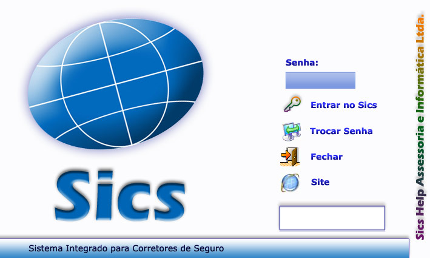

# Telas do SICS (referência para reconstrução)

Levantamento das telas/módulos do SICS original para guiar a reconstrução no
SicsOpen. Fontes: recursos de UI da própria instalação
(`data/SICSWIN_completo/Toolbar/`), o mapa de ícones do sistema
(`Toolbar/mapa_de_icones.htm`) e o site do fabricante.

> O SICS é o **"Sistema Integrado para Corretores de Seguro"**, da **Sics Help
> Assessoria e Informática Ltda.** ([sics.com.br](https://www.sics.com.br/)),
> empresa com 30+ anos de mercado. O produto desktop (SicsWin) evoluiu para
> WebSics (web/mobile) e ganhou o multicálculo **SuperCálculo** (2016). O
> SicsOpen reimplementa a linha **desktop**.

## 1. Login / Abertura

Acesso por **senha única** (sem usuário separado — bate com a tabela
[`usuarios`](../modelagem/sistema-operacao.md), onde o login é a própria senha).
Ações: **Entrar no Sics**, **Trocar Senha**, **Fechar**, **Site**.

→ SicsOpen: tela de login simples; autenticação **nova** no backend Rust (não
reaproveitar o hash legado).

## 2. Menu principal / Barra de ferramentas

Funções da barra (de `mapa_de_icones.htm`):

| Ícone | Função | Observação |
|---|---|---|
| Clientes / Proposta | Tela central de cadastro e pesquisa | núcleo do sistema |
| Agenda | Compromissos | tabela `agenda` |
| Sics Financeiro | Módulo financeiro | parcelas/cheques/comissões |
| Pesquisa de CEP | Busca de endereço | base `Sicscep.mdb` |
| Calculadora | Utilitário | — |
| Enviar E-mail / Sics Fax | Comunicação com cliente | — |
| Baixar Apólices em PDF | Importa apólices das cias | `pdfcia`, pasta PDF |
| Kits de cálculo | Atalhos p/ Porto, Azul, Allianz, Sul América, Mapfre, Itaú | integração externa |
| Sics Palm | Sincronização com handheld (legado) | descontinuar |
| Fale Conosco | Suporte | — |

## 3. Clientes / Proposta (tela central)

Subfunções (abas/botões): **Grau de Parentesco / Tipo de Relacionamento**,
**Observação do Cliente**, **Enviar E-mail ao cliente**, **Digitalização de
Imagens**, **Perfil do Segurado**, **Sinistros**, **Comissões**, **Prepostos**,
**Total de clientes na pesquisa**, **Imprimir Seguro**.

→ Modelagem: [clientes.md](../modelagem/clientes.md) +
[apolices-seguros.md](../modelagem/apolices-seguros.md).

## 4. Emissão por ramo (telas de proposta/apólice)

Telas específicas por produto, todas penduradas na apólice (`seguros` +
extensão do ramo):

- **Automóvel** (+ **Endosso de substituição**, **Endosso de inclusão**) →
  `seguro_auto`, `acessorios_auto`, `seguro_condutor`
- **Condomínio**, **Residência**, **Empresa**, **Imobiliário**, **Aluguel** →
  `seguro_re` + coberturas/bens → [ramos-elementares.md](../modelagem/ramos-elementares.md)
- **Consórcio**
- **Vida Individual**, **Vida em Grupo**, **Vida Prêmio**, **PGBL**,
  **Acidentes Pessoais** → tabelas de vida (hoje vazias →
  [versao-posterior/vida-saude.md](../modelagem/versao-posterior/vida-saude.md))
- **Super Cálculo** → multicálculo (produto à parte, ver §8)

## 5. Digitalização de Imagens (scanner)

Anexar/escanear documentos ao cliente/apólice: nova imagem, associar arquivo,
salvar, excluir, renomear, imprimir, enviar por e-mail, iniciar scanner, girar,
zoom, ajustar (altura/largura/janela), selecionar região.
→ `cliente_imagem`, `seguros_imagem`, pasta `Imagens_clientes`.

## 6. Relatórios / Gráficos

Geração de relatórios e gráficos com: imprimir, zoom, **gerar etiquetas**,
**Tele-Marketing**, ajuste de fonte, navegação de páginas, tipo de gráfico.
→ `tipo_relatorio`, `tipo_etiqueta`.

## 7. Sics Financeiro / Agenda

Módulos acessórios: controle financeiro (parcelas, cheques, comissões,
lançamentos) e agenda de compromissos/aniversariantes.
→ [financeiro.md](../modelagem/financeiro.md), `agenda`.

## 8. SuperCálculo (multicálculo) — ecossistema

Produto separado (2016) de cotação multicálculo, integrado ao "Sics Plus"
([supercalculo.com.br](http://www.supercalculo.com.br)). **Fora do escopo da V1**
do SicsOpen; mencionado para contexto. Os resquícios no banco aparecem em
`clientes_supersics`, `supersicsestat` e no
[subsistema de tarifação](../modelagem/versao-posterior/tarifacao-subsistema.md).

## Mapeamento tela → backend (SicsOpen)

Toda tela acima vira: componente React/Solid (só apresentação) + comando Tauri
que chama o backend Rust, que lê/grava no SQLite migrado e devolve DTO pronto.
Ver [../ARCHITECTURE.md](../ARCHITECTURE.md).

## Fontes
- [Sics Help — Página Inicial](https://www.sics.com.br/)
- [Sics — Ferramentas para corretores](https://sics.com.br/as-melhores-ferramentas-para-corretores-de-seguros.html)
- [WebSics Enterprise](https://www.sics.com.br/gerenciador-websics-enterprise-corretoras-seguros.html)
- [SICS Help: versão web e mobile (TI Especialistas)](https://www.tiespecialistas.com.br/review/sics-help-tem-como-meta-dobrar-numero-de-usuarios-com-versao-web-e-mobile-desenvolvida-em-genexus/)
- Recursos de UI da instalação: `data/SICSWIN_completo/Toolbar/` (não versionado)
